# Web Ocean 3D

A realtime spectral ocean and tropical island rendered with **Three.js**, **WebGPU** and
**TSL** — FFT wave synthesis, physically motivated water optics, a depth-driven shore break,
foam, caustics, buoyancy, wakes, underwater transitions and a volumetric sky, photographed
through a lens rather than a pinhole: a thin-lens circle of confusion, veiling glare over a
capped highlight, a sun-anchored flare the scene can occlude, and a per-preset ASC CDL grade.
With a graceful WebGL2 fallback from the same shader source.

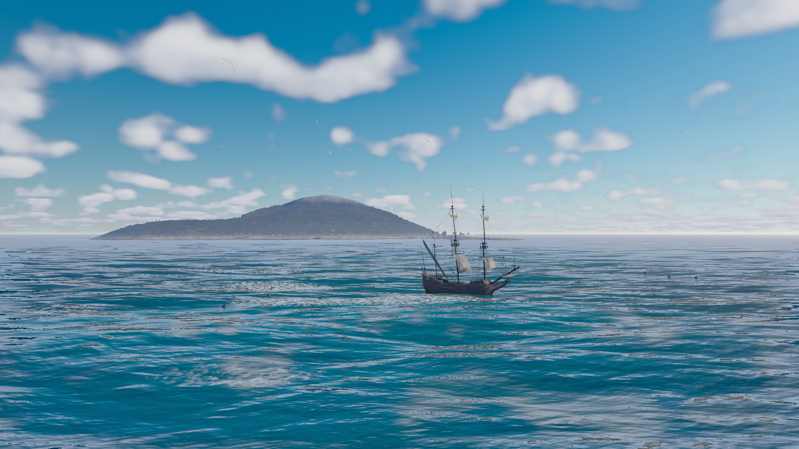

<p align="center"><em>A hundred metres off the hull, with the island a kilometre and a half
beyond it. Every image in this README is regenerated from the current renderer by one command;
none of them is hand-captured.</em></p>

<p align="center">
  
  
  
  
  
</p>

---

## Quick start

```bash
npm install
npm run dev            # http://127.0.0.1:5173
```

```bash
npm run build          # typecheck + production bundle
npm run preview        # http://127.0.0.1:4173
npm test               # Playwright suite (starts its own preview server)
```

Assets are committed, but the set is reproducible from scratch:

```bash
node scripts/fetch-assets.mjs             # idempotent
node scripts/fetch-assets.mjs --force     # re-fetch everything
node scripts/fetch-assets.mjs --verify    # offline integrity check
node scripts/optimize-assets.mjs          # decimate + Meshopt what actually ships
```

Most of it is CC0 from [Poly Haven](https://polyhaven.com). Twelve assets come
from Sketchfab instead, because Poly Haven publishes no marine life, no coconut
palm, and — for the shoreline — nothing that can be dropped at an arbitrary angle
without showing its back. Three of the twelve are CC0 Smithsonian coral scans;
**nine are CC-BY**, whose credits are a licence condition and are recorded in
[`ASSET_LICENSES.md`](ASSET_LICENSES.md#sketchfab-assets). Fetching those needs a
Sketchfab API token in `SKETCHFAB_API_TOKEN` or a git-ignored `sketchfab-token`
file; without one that step is skipped, which costs nothing unless you are
re-running the optimiser.

The raw downloads land in `assets/source/` rather than under `public/`, and that
is not filing: Vite copies `public/` into `dist/` verbatim, so while they sat
there the optimiser was being undone one directory up and the build shipped
818 MB of film-quality scan data that no URL points at. It ships 99 MB now.

`scripts/modelkit/` is the workbench for all of this — search and fetch Sketchfab
under a hard CC0/CC-BY filter, then measure what arrived:

```bash
node scripts/modelkit/sketchfab.mjs search "coral reef" --animated
node scripts/modelkit/inspect.mjs public/models/dressing   # triangles, alpha modes, texture slots
node scripts/modelkit/shells.mjs  public/models/dressing   # can this be placed at any angle?
node scripts/modelkit/plates.mjs  public/models/dressing   # is a scan's ground slab still attached?
```

**Requirements** — Node 20+, and a browser with WebGPU for the full experience
(Chrome/Edge 113+, Safari 18+). Without it the app falls back to WebGL2 automatically; the
**Force WebGL** switch exercises that path deliberately.

---

## Gallery

Nine environment presets. Each moves the sun, sea state, water optics, aerial perspective
and weather together — so switching reads as a different *place*, not a colour filter.

| Under way | Underwater |
|---|---|
| 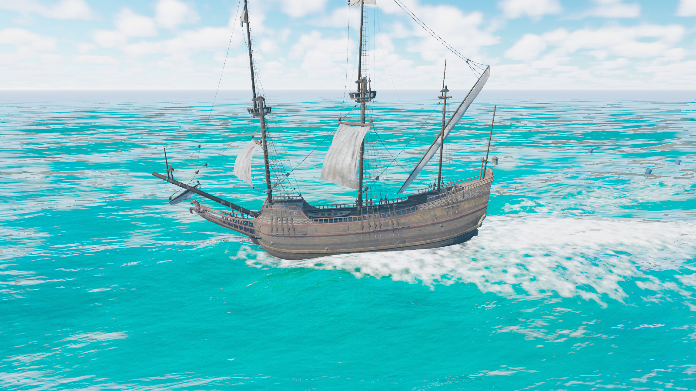 | 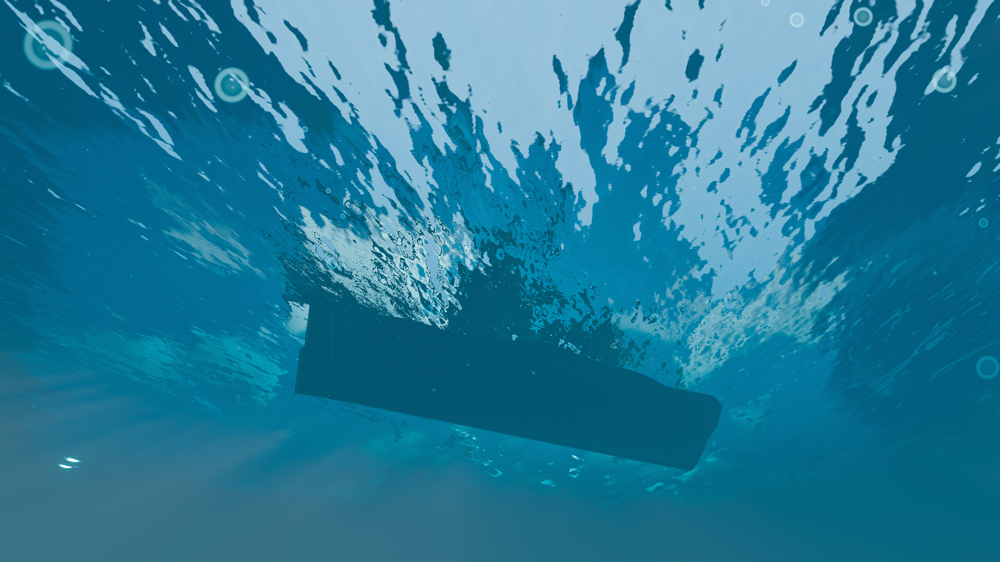 |
| Chase camera at ~8 m/s: Kelvin wake, bow wave, hull in wave contact | Snell's window overhead, the hull's silhouette and its shadow in the shafts |

| Storm | Moonlit |
|---|---|
| 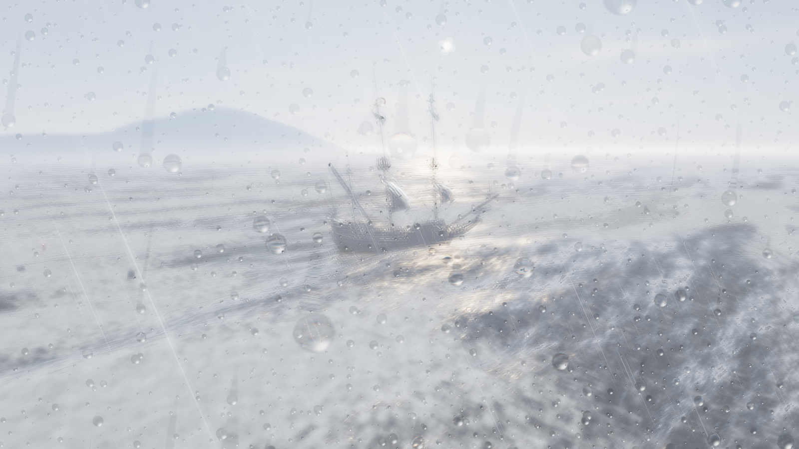 | 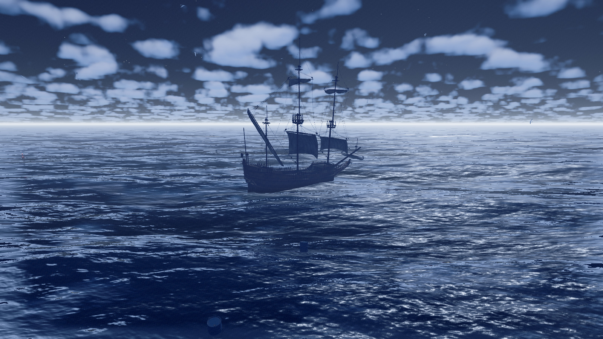 |
| 21 m/s, overcast attenuating the key light, rain on the lens | Sun below the horizon: moon glitter, star field, long swell |

| Sunset | Wave detail |
|---|---|
| 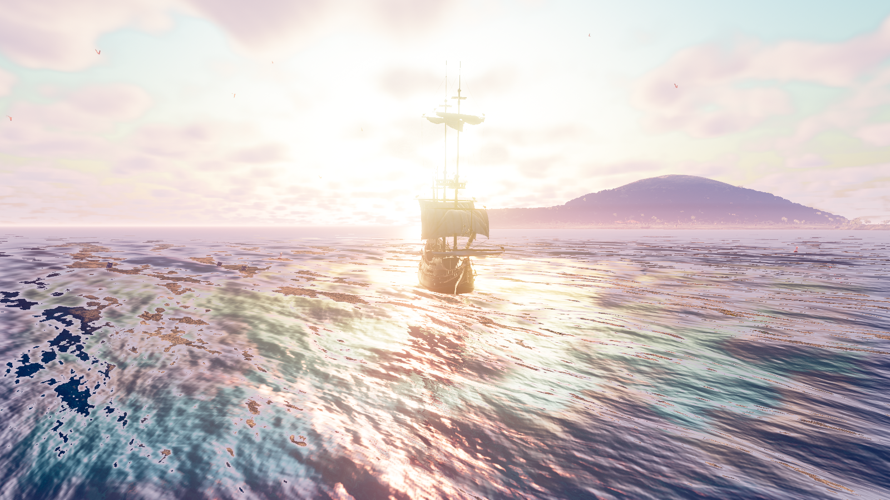 | 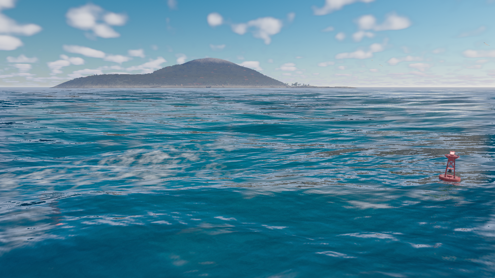 |
| Anisotropic glitter stretching down the sun's track | Whitecaps where the surface genuinely folds, at 15 m/s |

| Clear day | The night watch |
|---|---|
| 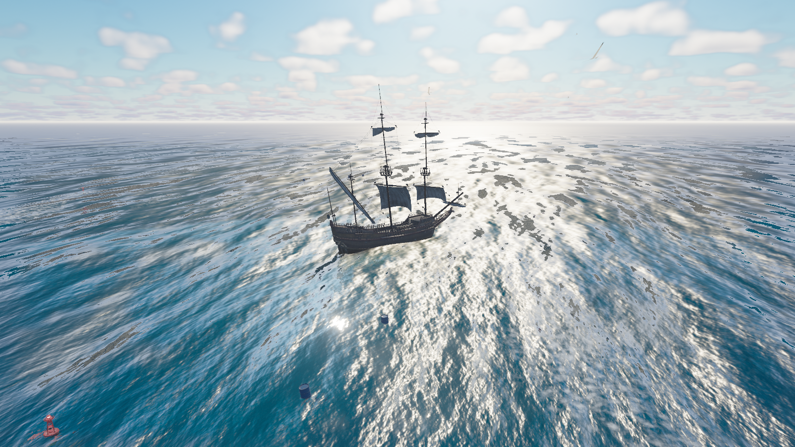 | 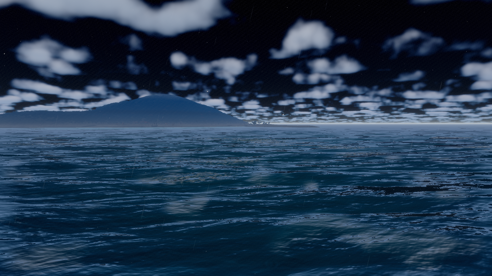 |
| The reference frame every measurement in this repository is taken against | The cinematic tour at 00:54 — moon glitter, star field, and a hull lit by nothing else |

| A squall | Landfall |
|---|---|
| 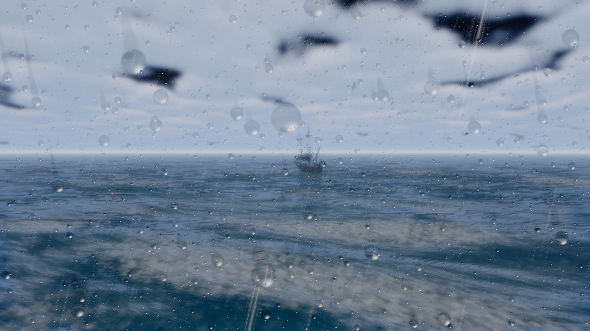 | 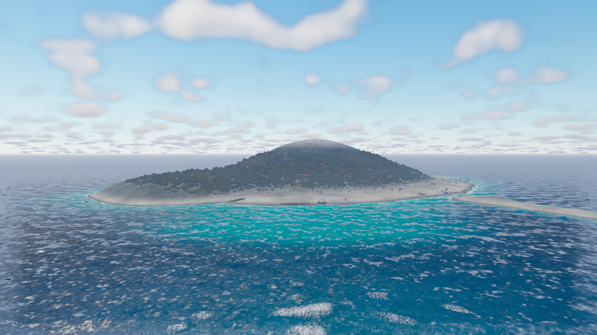 |
| The tour changing the weather: rain on the lens, the deck killing the key light, the hull wet | The island from the tour's stand-off, half a kilometre off the beach |

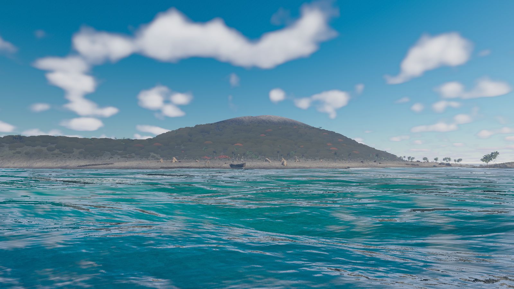

*The frame the terrain, the planting and the grade are tuned against, and the one the
reference in [`docs/ref/`](docs/ref/tropical-island-sea-level-v2.png) depicts. Bare coral sand to 3.5 m, a procedural
canopy over the flanks fading in over 90–180 m, baked billboard impostors standing
in for the planting beyond 60 m (understorey) and 120 m (trees), a pale rock crown
on the 150 m summit, and closed shoreline rock that can be dropped at any angle.*

| The shore break | Over the reef |
|---|---|
| 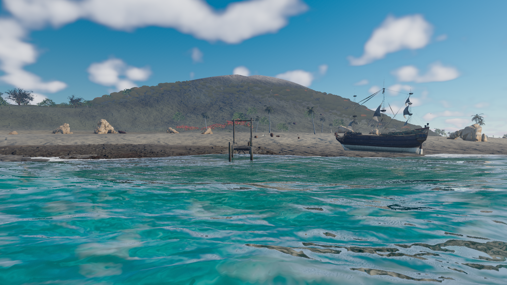 | 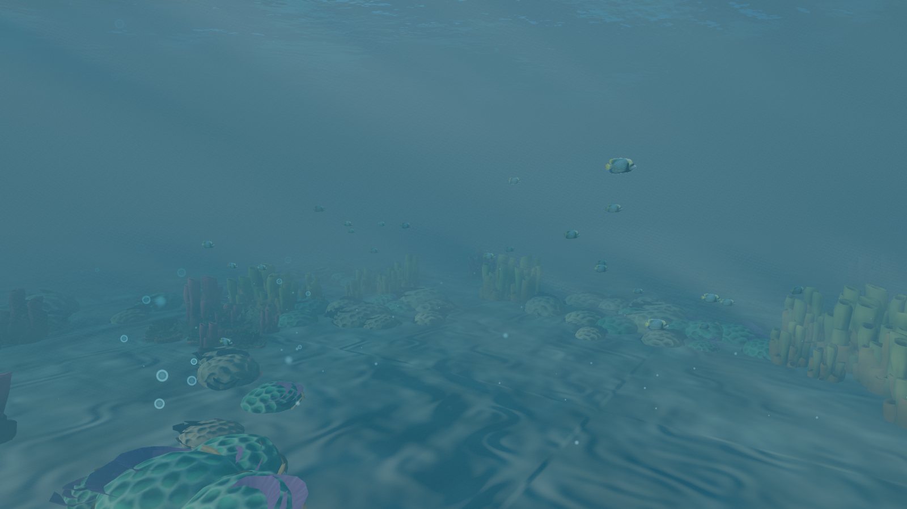 |
| Depth-driven breaking foam: the surf line sits where the water shoals to about 1.3 wave heights, so it walks seaward as the sea gets up | Coral, reef rock and kelp on the inner plateau, framed on a school's *measured* position rather than on the centre of the circuit it travels |

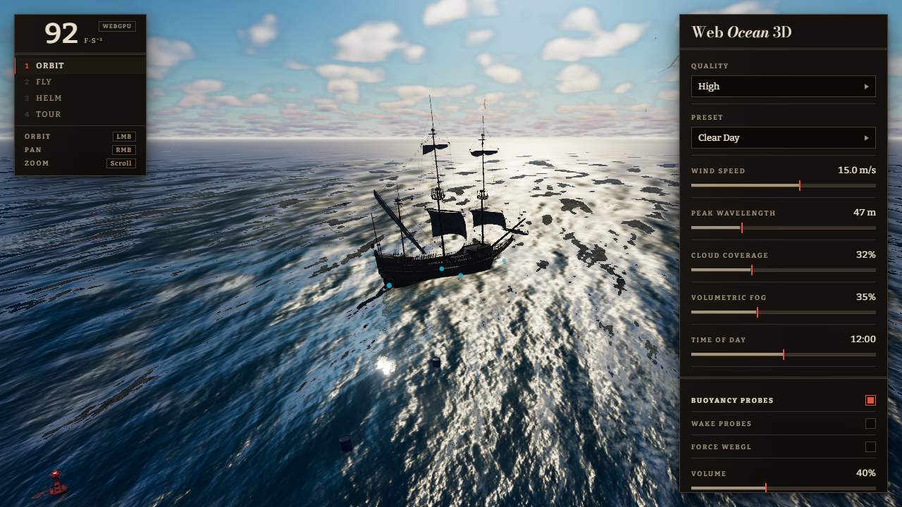

*The control panel and HUD. Buoyancy probes are switched on here, showing the four hull
sample points the physics solves against.*

Regenerate every image above from the current renderer:

```bash
CAPTURE_GALLERY=1 npx playwright test --project=visual gallery
```

That runs through the same deterministic harness the visual baselines use, at 1600 × 900,
one fresh page per image. Scene shots come from an offscreen render, so the UI is absent by
construction rather than hidden; the interface shot is a compositor screenshot precisely
because it is *about* the UI. The FPS readout is omitted from it on purpose — see
[Performance](#performance) for why a frame-rate number captured under browser automation
would be meaningless.

> These images were previously captured by hand and had gone stale by months of renderer
> work, with nothing able to tell. That is why regenerating them is now one command.

---

## Controls

| | |
|---|---|
| **1 / 2 / 3 / 4** | Orbit / Fly / Boat / Cinematic camera |
| **Orbit** | LMB drag rotate · RMB drag pan · scroll zoom |
| **Fly** | click to capture the mouse · WASD · Space/Ctrl up-down · **scroll** speed (1.5–600 m/s) · Shift boost |
| **Boat** | **W/S** throttle ahead and astern · **A/D** rudder · **drag** to orbit the chase camera · **scroll** to dolly · the hull is turned away from shoaling water rather than fenced by a radius |
| **Cinematic** | A looping 60 s authored tour in six beats — open water, outbound, landfall, return, squall, reef run — carrying its own hour and weather, so one lap runs a full day and a squall through the scene |
| **Touch** | Boat mode on a touch device gets an on-screen stick: forward for ahead, back for astern, left and right for rudder |

Boat mode selects the ship, not just a camera. Leaving it releases ship input, so Orbit and
Fly keep their own keys. The rudder is a foil: it has little authority until the ship has way
on, and it reverses when making sternway.

Drop the camera below the surface in any mode to trigger the underwater state.

---

## Features

**Ocean**
- Depth-aware refraction: the scene behind the surface, distorted by the wave normal, with
  the water column measured from the depth buffer and Beer–Lambert absorption over it
- Full microfacet BRDF — GGX distribution, height-correlated Smith visibility and Fresnel on
  the half-vector — with an **anisotropic** lobe whose along/across roughness ratio comes from
  Cox & Munk's measured slope variances, so the sun track stretches toward the viewer
- Geometric specular antialiasing, which is what keeps a lobe this narrow from spiking on the
  one wave face that happens to line the half-vector up
- **Snell's window and total internal reflection** on the underside: the whole sky compressed
  into a 48.6-degree disc, the underwater scene mirrored around it
- A meniscus at the waterline — rim highlight and lens pull where a ray crosses the surface
  within half a metre of the eye — and a per-preset refractive warp of the submerged image, so
  a storm looks through a disturbed lens and a glassy sunset does not
- Planar reflection of ship, props and clouds, sampled at a roughness- and distance-driven mip
  level rather than as a mirror, faded out at the frame edge and at grazing angles
- Persistent foam: breaking crests and the ship's wake deposit into one world-anchored buffer
  that decays over seconds, rather than a mask recomputed every frame
- JONSWAP spectrum with live wind-speed and peak-wavelength control, spread by the Hasselmann
  frequency-dependent directional model — so the dominant sea tracks the wind while the ripples
  are close to omnidirectional, which is what stops a wave field reading as corduroy
- Blendable standing waves, for sheltered water that bobs rather than sweeping through
- Three spectral cascades (1024 m / 128 m / 16 m tiles) — swell, chop and ripple with no
  visible tiling
- Jacobian-derived whitecaps: foam appears where the surface genuinely folds, biased toward
  crests, streaked along the wind and broken up with world-space noise, with a second
  lower-rate deposit on wind-facing faces that persistence carries over the crest
- Fresnel sky reflection, Beer–Lambert transmission, subsurface scattering on backlit
  crests, GGX sun specular
- Shallow-water tint driven by real seafloor depth
- **Depth-driven shore break.** Waves break where they run out of water, not where they steepen:
  the surf line sits where the seabed shoals to about 1.3 wave heights, so it walks seaward as
  the sea gets up, and arrives in sets with real lulls between them

**World**
- Steerable sailing ship: throttle and rudder resolved into forces the buoyancy solver
  integrates, so propulsion composes with heave, pitch and roll instead of overriding them
- Kelvin wake that *deforms* the water, not just foams it: the transverse and divergent wave
  systems and a bow wave, with `k = g/V²` so the crests lengthen as the square of speed
- Rain wets what it lands on — wood and canvas darken and gloss in a squall, and stay damp for
  half a minute after it passes
- Cloud shadows drift across the water, sampled from the same density field the clouds are
  drawn from
- Buoys and barrels floating independently
- **Canopy impostors.** Past 90 m the island's forest becomes camera-facing cards,
  placed straight off the heightfield node so they stop exactly where the terrain's green stops.
  One draw, two triangles a card, no texture and no shadow — and it is what gives the island a
  broken silhouette instead of a painted dome
- The hull is turned away from shoaling water by the seabed gradient rather than by a fence,
  so the same rule handles the beach, the reef and the spit without knowing about any of them
- Procedural seafloor with animated caustics, and a 1 km island carved from the same
  heightfield the buoyancy solver and the prop scatter query — bays, an offset crest, a
  raised headland and a lagoon, so no two bearings show the same coastline
- The island's biome lives in the terrain colour, not only in instances: 0.8 km² of ground
  cannot be covered by trees at any triangle budget, so elevation drives bare sand into
  scrub into closed canopy into summit rock, and the models are the hero layer standing in it
- GPU grass that tiles around the camera rather than the world, placed from the heightfield
  in the vertex stage, with per-instance LOD dealing for every scattered kind
- Preetham-model sky with raymarched volumetric clouds, stars, moon, rain and snow

**Underwater**
- **A per-pixel waterline.** The medium is integrated over the segment of *each eye ray* that
  lies below the surface, with the surface taken from the wave field where the ray meets it —
  so air and water appear in the same frame and the line follows the crests
- Per-channel extinction, drifting particulates and bubble columns
- God rays marched in *world* space against the caustics field, so the shafts and the pattern
  they cast on the seafloor are one evaluation of one field rather than two effects tuned to
  resemble each other
- Continuous cross-fade across the waterline rather than a hard cut, and the camera crosses it
  freely in either direction

**Engineering**
- Volumetric height fog with per-preset extinction and a live density control
- Five quality tiers plus adaptive downgrade under sustained load
- Live pixel-ratio control
- Deterministic test hooks for automated verification

---

## Architecture

```
src/
  core/        renderer bootstrap + fallback, frame loop, quality tiers, seeded random
  ocean/       spectrum, FFT, simulation, mesh, surface shading, planar reflection, SSR, CPU sampler
  sky/         atmosphere, volumetric clouds, aerial perspective, weather
  underwater/  fog and god rays, particulates, caustics
  post/        depth of field, bloom, lens flare, grade, volumetric fog, lens rain, output transform
  scene/       asset loading, ship, props, seafloor, island planting, fish, birds
  physics/     buoyancy, ship control, wake accumulation, spray
  cameras/     orbit / fly / boat / cinematic director, and the authored tour
  audio/       synthesised ambience — noise beds, not samples
  ui/          control panel, HUD, touch controls (framework-free DOM)
  presets/     nine environment definitions
```

`docs/SPEC.md` carries the same tree file by file.

### Design decisions worth explaining

**One shader source, two backends.** Three's `WebGPURenderer` compiles the same TSL node
graph to WGSL or GLSL, so the WebGL2 fallback is a configuration flag rather than a parallel
codebase.

**FFT waves, not a Gerstner sum.** A Gerstner sum needs hundreds of waves before it stops
looking periodic. An FFT gives a full directional spectrum at fixed cost and — more usefully
— yields the *Jacobian* of the displacement map, which is physically where whitecaps form.
Foam is therefore derived, not painted.

**The IFFT runs as fragment passes, not compute.** Three's WebGL2 backend has neither compute
shaders nor storage textures, so a compute implementation would need a separate fallback
path. At our sizes the transform is not the bottleneck; surface shading is.

**Geometry LOD and shading LOD are separate curves.** Vertex spacing on the radial ocean grid
grows with radius, so a cascade must stop *displacing* geometry well before it stops
contributing *normals*. Conflating the two is what makes naive ocean meshes sparkle — every
triangle lands on a random phase of a wave it cannot resolve. Geometry flattens with distance
while mipmapped derivative textures carry fine detail to the horizon.

**Buoyancy reads back asynchronously.** A small slice of the displacement field is copied to
host memory without awaiting the GPU fence. One frame of staleness on a floating hull is
invisible; a pipeline stall is not.

---

## Verification

Two suites. The functional one asserts behaviour; the visual one compares fifteen canonical
shots against checked-in baselines with a CIE94 ΔE metric whose thresholds come from a
*measured* run-to-run noise floor — not pixel-exact equality, which no GPU render can hold to.
Method, metric and per-shot thresholds are in [`docs/VERIFICATION.md`](docs/VERIFICATION.md).
Notable checks:

- Sea state read straight off the GPU: crest amplitude in metres, no non-finite values,
  whitecap coverage under 8%
- Boot on both backends with zero console errors
- Presets must each change the image and not collapse to one look
- Texture and geometry counts across repeated quality cycles, to catch leaks
- Layout overflow from 360 px to 1920 px

**Measured numbers**, read off the GPU rather than judged by eye:

| Quantity | Measured | Source |
|---|---|---|
| Folded surface area (J < 0), cascade 0 at 15 m/s | **3.8%** | `produces a physically plausible sea state` (gate: `< 8%`) |
| Crest amplitude, cascade 0 | **±1.4 m** | same (gate: `0.4 m … 12 m`) |
| Surface below the break threshold (J < 0.14) | **5.5%** | one-off histogram of the Jacobian readback; drives the deposit rate |

> These three were measured against the previous fixed-exponent directional
> spread and have **not** been re-measured since it became frequency dependent.
> They have certainly moved: at an unchanged deposit rate the new spectrum
> rendered 0.60–0.67 of the old whitecap coverage at every wind speed from 6 to
> 24 m/s, which is only possible if less of the surface is reaching the fold
> threshold. The two gated figures still pass their gates by a wide margin —
> that is what `produces a physically plausible sea state` checks, and it does —
> but the exact percentages above are stale. Left labelled rather than replaced
> with numbers nobody has read off the GPU, which is the whole point of the
> notes below.

> This table previously quoted "whitecap coverage 4.6%, asserted by
> `produces a physically plausible sea state`". That test reads displacement
> Jacobians and asserts only `foldedPercent < 8`; it never reads the foam buffer
> and never measured rendered whitecap coverage. The figure was a plausible number
> attached to the wrong source. Coverage is now genuinely measured —
> `tests/foam.spec.ts` renders the surface at five wind speeds and holds it to
> Monahan's law within a factor of three, which is the figure quoted under Known
> Limitations below.

> An earlier revision of this table also quoted a buoyancy/wave-slope correlation,
> a seafloor CPU/GPU agreement figure, a wake spread angle and a sky zenith
> colour. No assertion in the suite produced any of them, so they were removed
> rather than left standing as unsourced numbers. Both notes are kept because the
> failure mode they record — a real measurement drifting loose from its source and
> being republished as an assertion — is the one this project has actually made,
> more than once.

Bugs found by measuring rather than looking, none of them visible to typecheck:

1. The FFT butterfly twiddle exponent used the group width where it needed the half-span,
   applying `W^(N/2) = -1` to every odd row at stage 0.
2. Geometry and shading shared one LOD curve, undersampling the wave field into speckle.
3. The volumetric fog and underwater passes built their view ray with NDC y taken straight
   from a top-down screen uv, so every ray's vertical component was inverted. It read as fog
   rather than as a broken ray: the sky integrated the whole height-fog column and every
   preset rendered as a white-out. The tell was that it did not respond to density — a 175×
   sweep of the slider produced the same white, because both ends were saturated.
4. The panel placed its sliders by array index, so inserting two controls pushed the last two
   off the end. They were declared, had labels and formatters, and were never built.
5. A helper introduced to *fix* undefined reversed-edge `smoothstep` had its own edges the
   wrong way round and returned a constant zero. It was caught by a new test asserting the
   effect was visible at all, which is the argument for having one per effect.

---

## Performance

Frame work measures **0.86 / 8.26 / 13.72 ms** GPU p50 at Low / High / Max on WebGPU at
1600 × 900 DPR 1, against a 16.7 ms budget. WebGL2 Low measures **7.36 ms** against 33.3 ms.
All seven benchmarked configurations pass, with no console errors during the sample.

Those numbers are two to three times what they were, and the trade is written down in
[`docs/PERFORMANCE.md`](docs/PERFORMANCE.md): the sky is a cloud layer wrapped on a sphere
so the deck converges into the horizon instead of stopping in a band, every material shares
one per-channel aerial perspective, the island marches its own shadow against the heightfield
because a ±260 m shadow box cannot cover a kilometre of island, and shafts, caustics and
contact darkening reach everything standing on the ground. Nearly all of the increase is in
raymarches whose step counts are tier fields, which is why Ultra and Max could be brought
back under budget by re-cutting four numbers.

**Read that with care.** Automated Chromium throttles `requestAnimationFrame` independently
of load — this project measured 1.1 "FPS" while spending 0.8 ms per frame, and the same
~1 fps appears with every effect disabled. The test suite therefore gates on per-frame *work*
(16.7 ms WebGPU, 33.3 ms WebGL) and only asserts frame rate when the browser is demonstrably
not throttling. `frameMs` is also wall-clock around the render call, and WebGPU submits work
asynchronously, so it **undercounts true GPU time**.

Full methodology, cost model and the honest list of what remains unmeasured:
[`docs/PERFORMANCE.md`](docs/PERFORMANCE.md).

---

## Known limitations

- **No temporal antialiasing or reconstruction.** Geometry is multisampled at 4x and the output
  carries a spatial FXAA resolve at 0.3, but every stochastic effect here — the fog march, the
  cloud march, the shaft march, the specular lobe — still resolves spatially within one frame.
  A spatial filter can soften a shading stair-step; it cannot supply the samples that made it.
  This remains the largest single thing between the current image and a shipping one: it is
  what would let every march trade samples for frames. It is *not* what the far-field shimmer
  turned out to need — that was an under-filtered anisotropic sampler, and fixing it where it
  lived cut the measured figure by 44% without any temporal machinery.
- **Screen-space reflection is full-resolution, single-ray and non-temporal.** It cannot
  reconstruct off-screen content or a rough lobe. The *planar* layer is now sampled at a
  roughness-driven mip level, so the composite is no longer a mirror, but there is still no
  prefiltered probe and no stochastic sampling with a temporal resolve.
- **Specular antialiasing discards the anisotropic covariance.** Two terms feed `alpha²` and
  neither carries it. The screen-space one is the geometric variant, which adds the scalar
  magnitude of the shading normal's derivatives; the other recovers the slope variance the mip
  chain destroyed, from a second moment stored alongside the slope, but stores it isotropically
  because only one texture channel was spare. So neither knows that a pixel's normal varies
  more along the wind than across it, which for this surface is the interesting part.
- **The grazing reflection fade is art-directed, not a Smith term.** It bottoms out at 0.45
  where a real masking function goes to zero, and it multiplies the Fresnel blend rather than
  acting as the BRDF's geometry factor. (The *specular* Smith visibility is a real
  height-correlated anisotropic term; this is a separate, cruder fade on the environment
  reflection.) See `GRAZING_SLOPE_SIGMA`.
- **Refraction is a normal-driven UV offset, not a refracted ray.** Snell's law is not solved
  and the offset ray is not intersected with scene geometry; the depth read that follows it is
  real, and drives real absorption, but the displacement itself is an approximation. The same
  is true of the total internal reflection on the underside — it is a screen-space offset, so
  it reflects only what is on screen and falls back to the water's body colour elsewhere.
- **The wake is Kelvin-*inspired*.** The dispersion relations are right, which is what makes it
  scale correctly with speed, and the features are now anchored to the stem and the transom
  rather than to the hull's centre — but it is still an authored sum of two systems and some
  envelopes: no hull pressure distribution, no stationary-phase cusp, no Froude-number
  response, no finite depth, and no propagation of history at the group velocity.
- **Foam reads as broad ribboning**, not sparse multiscale bubbles and streaks. The rendered
  coverage *is* now measured against Monahan's `W = 3.84e-6 U^3.41` and tracks it to within a
  factor of three from 6 to 24 m/s (0.27 / 0.30 / 4.94 / 11.92 / 12.33 % against 0.17 / 0.69 /
  3.93 / 12.39 / 19.54) — so the amount of foam is right and its *structure* is not.
- **Cloud shadow is a one-sample approximation.** It traces to the middle of the slab along the
  sun path and attenuates by density times path length — the same field the clouds are drawn
  from, so the shade lands under the cloud that casts it, but it is not an integral through the
  layer. Clouds themselves are still a procedural slab: no weather map, no multiple-scattering
  approximation, no temporal reprojection.
- **Underwater sun occlusion covers the hull only.** An analytic ellipsoid in the hull's frame,
  plus the cloud deck. A diver under a barrel gets full shafts.
- **Rain wetting has no runoff.** Wetting is driven by the geometric world normal, so the deck
  and the upper faces of the rail soak while the underside of a beam stays dry, but water does
  not run down, streak, or pool in a concavity — that needs surface flow or at least local
  curvature, and neither is modelled.
- **`refraction: 0` is a visual policy, not a cost saving.** The backdrop and depth reads are
  unconditional in the node graph; a tier that sets it to zero still pays for them.
- **The far sea reflects an analytic stand-in, not the rendered sky.** The planar reflector is
  faded out as the view goes grazing — it cannot be trusted there — so in the far band the water
  reflects a single horizon colour derived from the hemisphere light. Reducing the whitening on
  that colour from 42% to 14% recovered part of the saturation the reference has; a correct fix
  is a directional sky evaluation or LUT sampled along the reflected ray, which is not done.
  Two other explanations were tested first and disproved by measurement: weighting the aerial
  perspective by `1 - fresnel` moved the sample one level, and correcting the haze colour and
  halving its density moved it three.
- **The water column ignores instantaneous wave height.** `Seafloor.depthNode()` returns depth
  below *mean sea level*, so on a crest the analytic thickness is about a metre short, and the
  shore break's criterion uses seabed depth rather than surface-minus-floor. Shelves therefore
  do not appear and disappear under passing swell the way the brief asks.
- **The island is outside the shadow cascade.** The sun's shadow camera covers ±260 m around the
  viewer; from the approval camera the island is 780 m away, so none of it casts or receives
  sun shadows and the hill is uniformly lit. The distant canopy impostors are unlit by cloud
  shadow and terrain occlusion for the same reason.
- **One machine.** Every performance figure comes from a single RTX 5090; nothing here
  establishes where the quality tiers stop working.
- Playwright's bundled Chromium exposes no WebGPU adapter, so it renders through a software
  rasteriser. Screenshot-dependent tests skip there rather than being loosened until they
  pass; a software-runner result is inconclusive, not a pass.

---

## Documentation

- [`docs/SPEC.md`](docs/SPEC.md) — feature matrix, visual checklist, measured behaviour
- [`docs/PERFORMANCE.md`](docs/PERFORMANCE.md) — methodology, budgets, cost model
- [`docs/VERIFICATION.md`](docs/VERIFICATION.md) — the visual harness: the canonical shots, the
  capture protocol, the ΔE metric and where its thresholds come from
- [`ASSET_LICENSES.md`](ASSET_LICENSES.md) — every asset, source, author and licence
- [`PRODUCT.md`](PRODUCT.md) and [`DESIGN.md`](DESIGN.md) — who this is for, and the interface
  system recorded from the built UI rather than from an intention written before it

---

## Licence and provenance

Project code is original. Techniques are implemented from published literature — Tessendorf's
FFT ocean, JONSWAP and Pierson–Moskowitz spectra, the Preetham sky model — and from
MIT-licensed Three.js examples.

**Most** 3D models and HDRIs are CC0, sourced from
[Poly Haven](https://polyhaven.com), for which no attribution is legally required — the
authors are recorded anyway. The exceptions matter: twelve assets come from Sketchfab, of
which three are CC0 Smithsonian coral scans and **nine are CC-BY 4.0, whose attribution is a
condition of the licence and must survive redistribution**. Those nine credits are collected
in one block in [`ASSET_LICENSES.md`](ASSET_LICENSES.md#sketchfab-assets); every asset,
source, author and licence is listed there. Typefaces ship unmodified under SIL OFL 1.1.

Dependencies: three.js (MIT), Vite (MIT), TypeScript (Apache-2.0), Playwright (Apache-2.0),
`@vercel/analytics` (MIT).
